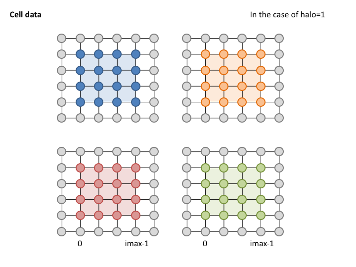
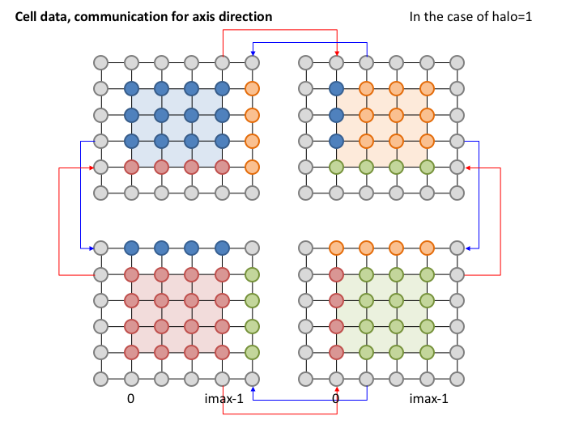
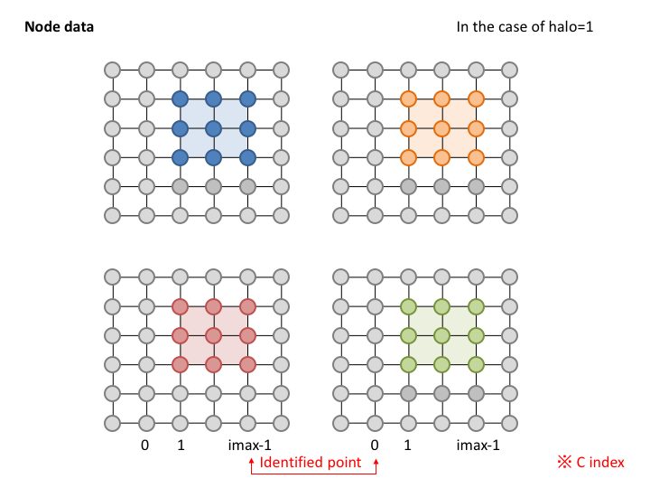
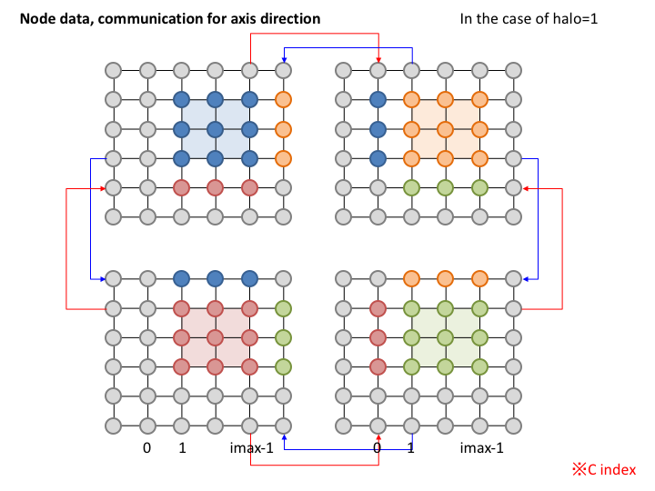

# CBrick document

---
## 提供機能

- サブドメイン管理
  - 領域分割（各方向の分割数指定、プロセス数のみ指定で自動分割）
  - 通信テーブル作成
  -

- 通信ラッパー機能
  - 隣接間通信
  - 大域通信
  - ラッパー（型など）

- ユーティリティ
  - 時間計測
  - ファイルパス操作

---
## CBrickのコンセプトと使い方

### コンセプト
- 並列アプリケーションを記述するために使う補助的な機能をコンパクトなクラスライブラリにしたもの。
- メモリ周りの管理はアプリ側で行う。ただし、通信バッファについては、Commクラス内で管理する。
- MPI, OpenMP, OpenACCなどの広く利用されるAPIが提供する機能と併用し、便利に利用できるラッパー程度を提供。
- 通信部分のチューニングなどをやりやすいように、speificに作り込まない（アプリ側で行う）。

### 想定する使い方
exampleに三次元非定常拡散方程式のサンプルが納められています。makefileやcmakeを参考にビルドしてください。使い方としては、次の２つの方法があります。
1. ライブラリ形式で別にビルドしておき、リンクして使う。
2. 作成するアプリケーションのソースツリーに含めて、提供クラスを使いながらアプリを記述する。このため、基本的にメンバ変数はpublic属性とする。

---
## メモ

### 領域分割

- 各サブドメインの格子サイズをN, ガイドセル長をgとする。
- Fortranの配列形状では a(1-g:N+g)とする。
- NODEとCELLで接続状況が異なる。

#### NODE
~~~
[FORTRAN]

  1  2                                                                                      NG : Global
  |  <================================== Inner region ====================================>  |
  |  <==  Inner   ==>  <==  Inner   ==>  <==  Inner   ==>                     <== Inner ==>  |
  |--+-----------+--|--+-----------+--|--+-----------+--|--------//--------|--+-----------+--|
  1  2             N0                 1  2             N2                  1  2             Nn : Local
                    1  2             N1
~~~

- 計算領域全体の内部領域は、[2, NG-1]である。
- 各サブドメインで担当する内点は基本的に[2, N]の範囲、但し外部境界を含むサブドメインは[2, N-1]となる。

~~~
[FORTRAN]
           (Rank 0)
      -3    -2    -1    N0    +1    +2    
  -----+-----+-----+-----|-----+-----+
                   v     v     ^     ^   
             +-----+-----|-----+-----+-----+-----
            -1     0     1     2     3     4
                           (Rank 1)

[C]
          (Rank 0)
      -4    -3    -2    N0-1   N0   N0+1  
  -----+-----+-----+-----|-----+-----+
                   v     v     ^     ^   
             +-----+-----|-----+-----+-----+-----
            -2    -1     0     1     2     3
         (Rank 1)
~~~

- 隣接間通信での対応するインデクスは上記のとおり。

#### CELL
~~~
[FORTRAN]

   1  2                                                                                    NG : Global
  |<==================================   Inner region   ====================================>|
  |<==   Inner   ==> <==   Inner   ==> <==   Inner   ==>                    <==   Inner   ==>|
  |--+-----------+--|--+-----------+--|--+-----------+--|--------//--------|--+-----------+--|
   1  2           N0                   1  2           N2                    1  2           Nn : Local
                     1  2           N1
~~~

- 計算領域全体の内部領域は、[1, NG]である。
- 各サブドメインで担当する内点は[1, N]の範囲となる。

~~~
[FORTRAN]
           (Rank 0)
    -3    -2    -1    N0    +1    +2    
  -----+-----+-----+-----|-----+-----+
                v     v     ^     ^   
             +-----+-----|-----+-----+-----+-----
               -1     0     1     2     3     4
                           (Rank 1)

[C]
          (Rank 0)
    -4    -3    -2   N0-1   N0   N0+1  
  -----+-----+-----+-----|-----+-----+
                   v     v     ^     ^   
             +-----+-----|-----+-----+-----+-----
               -2    -1     0     1     2
         (Rank 1)
~~~

- 隣接間通信での対応するインデクスは上記のとおり。

### 斜め方向の通信の様子
#### Cell

#### Node

### 隣接間通信

- 送受信面のガイドセルの幅も含めてコピー。
- ステンシル方向は層の数を指定。

#### スカラー配列
- 配列形状は v(i,j,k) とする。
- Z面の通信はメモリ連続になるので、packの必要はなし。Y, X面はpack/unpackが必要。

#### ベクトル配列
- 配列形状は v(i,j,k,l), 成分 l=1~3 とする。
- Z, Y, Xの全ての方向でpack/unpackが必要。
- あるいはスカラーx3回の実装も可。

### 大域通信
- 基本的にMPIが提供する仕様のラッパーとする。

---
## 領域分割のアルゴリズム

### 提供機能
A) 全計算空間の節点数とプロセス数を与え、最適な分割数を計算する。

B) 全計算空間の節点数、各方向の領域分割数を与える。各方向の領域分割数の積はプロセス数となる。

上記の二つの場合に対して、各サブドメインの節点数、基点インデクス、隣接ランク情報を作成する。

#### 最適分割数の探査

1. given : 計算領域全体の節点数、プロセス数 => プロセス数の因数分解の全組み合わせ数を求める。
2. 求めた分割数の組み合わせに対して、各サブドメインの総節点数（計算量）と有効表面積（通信量）を計算し、ランク付けし、最適な分割数を得る。
  - まず、計算量の点から候補をソートする。サブドメイン間の計算量のロードバランスが適切であるかどうかが指標となる。具体的には、計算量の最大値と最小値の大きさを最大値で割った値が小さい順にソートする。
  - つぎに、第一候補群に対して、有効表面積からランク付けする。
  - さらに、XY面の通信量の多いものから選択する。これはXY面の通信は、pack/unpackの前処理が不要なため、コスト的に有利であるため。
